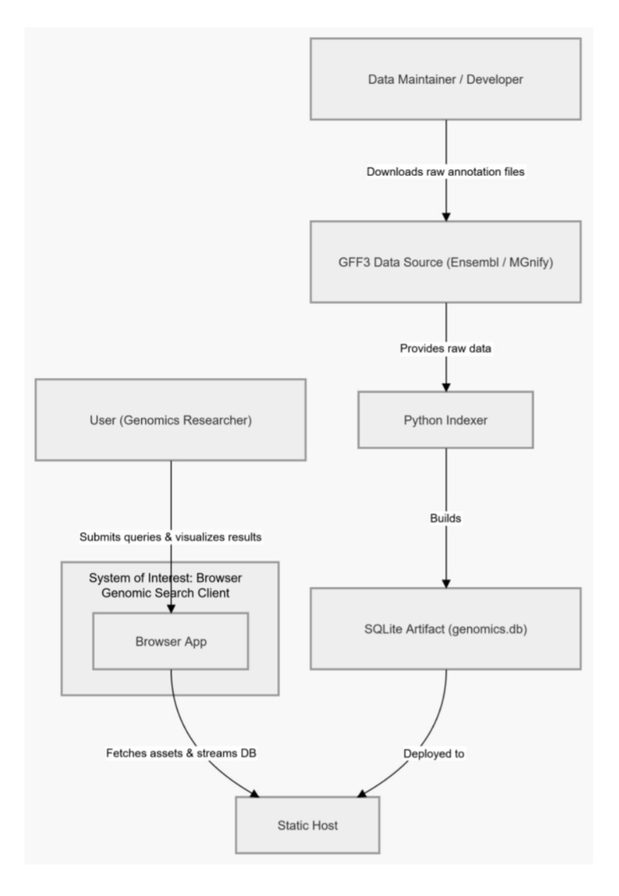
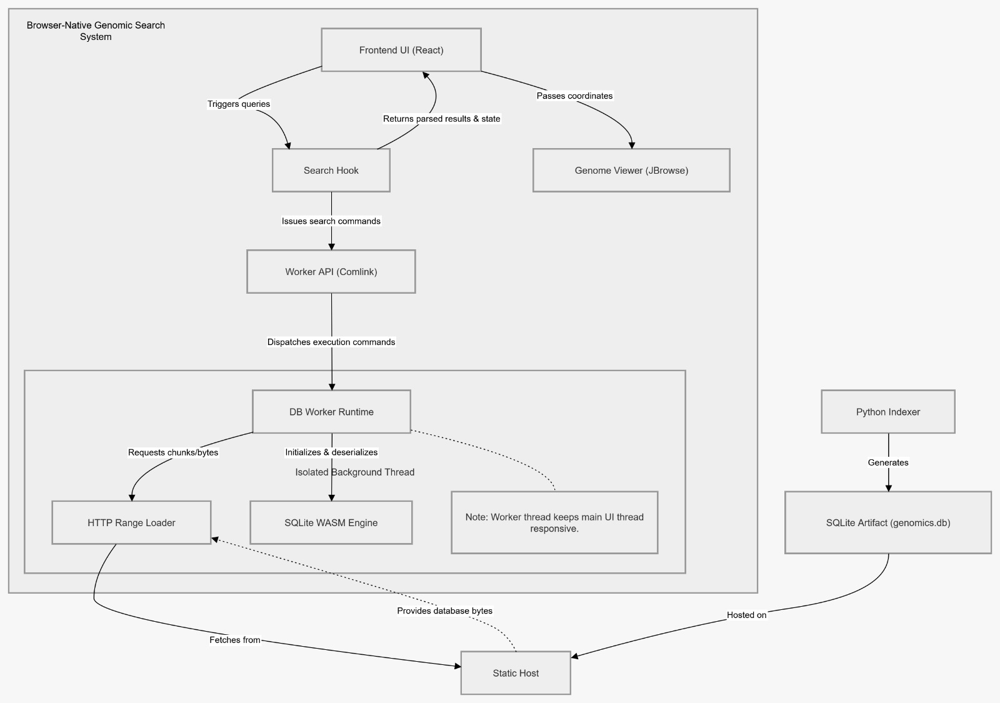
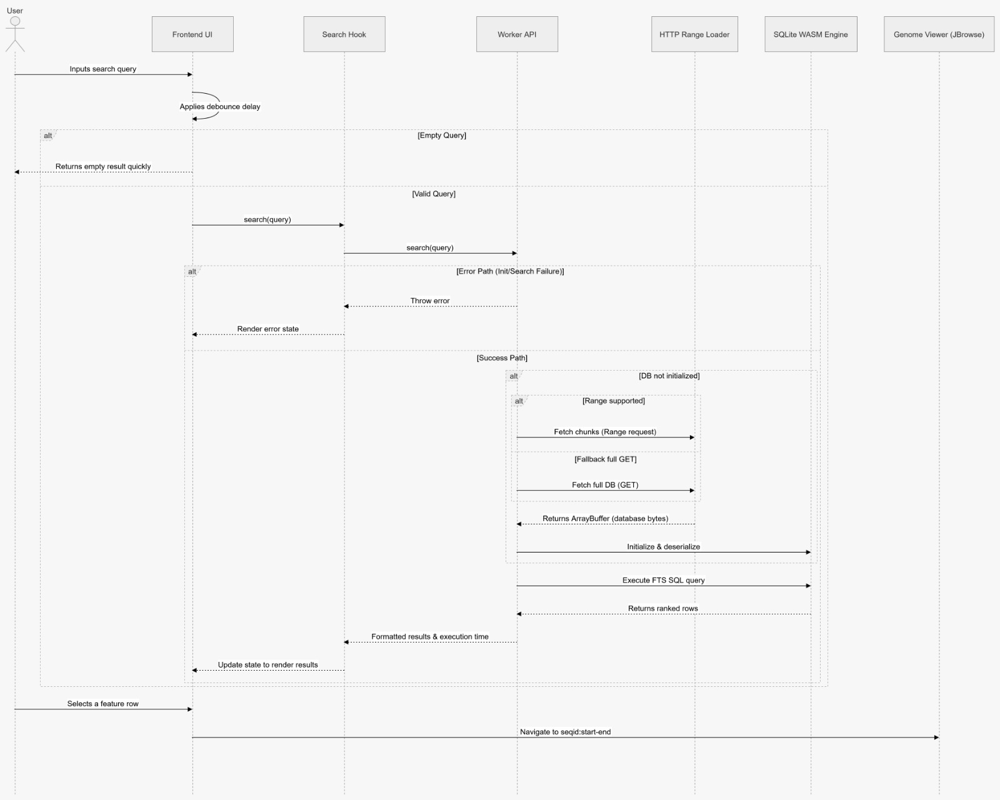
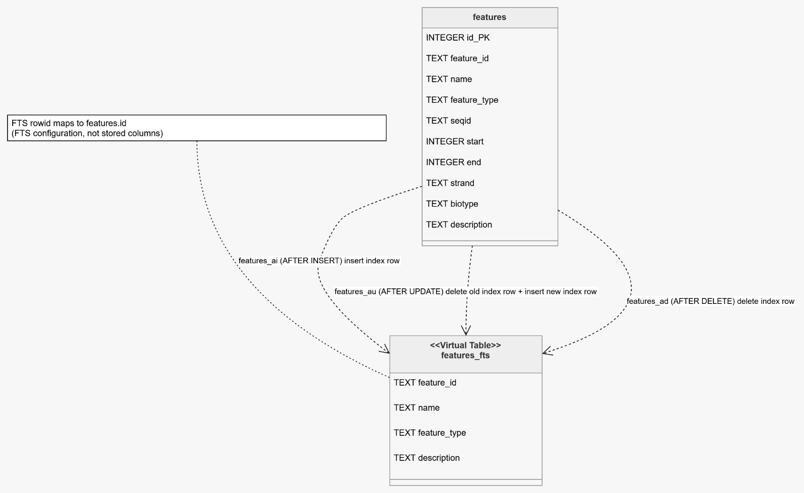

# Genomic Feature Search POC

Browser-native genomic feature search using SQLite FTS5 and SQLite WASM, with interactive navigation in JBrowse.

## Why this project exists

Large GFF3 annotation files are difficult to search interactively without heavy backend infrastructure. This project demonstrates a local-first architecture:

1. Build a search-optimized SQLite database offline from GFF3.
2. Serve that database as a static artifact.
3. Query it in-browser with SQLite WASM (inside a Web Worker).
4. Navigate matching features in an embedded genome browser.

This is an exploratory proof of concept designed for the Ensembl GSoC project idea on browser-side genomic feature search.

## Key features

1. Python indexer that converts GFF3 into SQLite.
2. FTS5 full-text index for fast feature search.
3. Trigger-based synchronization between main table and FTS table.
4. Browser-side SQL querying via `@sqlite.org/sqlite-wasm`.
5. Worker-based execution to keep UI responsive.
6. HTTP range-aware database loading with fallback to full download.
7. Search-to-location navigation in JBrowse.
8. Automated tests for schema, data integrity, triggers, search, and CLI behavior.

## Architecture overview

### Offline pipeline

1. Input: GFF3 file (`scripts/sample.gff3` or larger data).
2. `scripts/indexer.py` parses annotations and builds `public/genomics.db`.
3. SQLite schema includes:
	- `features` table (coordinates + metadata)
	- `features_fts` virtual table (FTS5)
	- sync triggers (`features_ai`, `features_ad`, `features_au`)

### Runtime pipeline

1. React app starts and initializes worker through `src/hooks/useDbSearch.ts`.
2. Worker (`src/workers/db.worker.ts`) fetches `public/genomics.db` (range-aware path in `src/workers/httpRangeLoader.ts`).
3. Worker initializes SQLite WASM and deserializes DB bytes into an in-memory database.
4. Search queries execute with FTS5 `MATCH` + rank ordering.
5. UI renders results (`src/components/SearchBar.tsx`).
6. Selected result navigates JBrowse (`src/components/GenomeBrowser.tsx`).

## Architecture diagrams


### 1) System context



Shows external actors and boundaries: user, developer, GFF3 source, browser client, and static host.

### 2) Component architecture



Shows internal runtime structure: React UI, hook/orchestration, worker API, DB worker runtime, HTTP range loader, SQLite WASM, and JBrowse integration.

### 3) Sequence flow (search to navigation)



Shows request flow and alternate paths: debounce, empty query, init error path, range-supported load, full-GET fallback, query execution, and JBrowse navigation.

### 4) Data model and FTS synchronization



Shows `features`, `features_fts`, trigger behavior (`features_ai`, `features_au`, `features_ad`), and rowid mapping (`content_rowid='id'`).

## Repository structure

```text
genomic-search-poc/
|- scripts/
|  |- indexer.py
|  |- test_indexer.py
|  |- sample.gff3
|  \- MGYG000512084.gff
|- docs/
|  \- diagrams/
|     |- system-context.png
|     |- component-architecture.png
|     |- sequence-search-flow.png
|     \- data-model-fts.png
|- src/
|  |- components/
|  |  |- SearchBar.tsx
|  |  \- GenomeBrowser.tsx
|  |- hooks/
|  |  \- useDbSearch.ts
|  |- workers/
|  |  |- db.worker.ts
|  |  \- httpRangeLoader.ts
|  |- App.tsx
|  |- App.css
|  \- main.tsx
|- public/
|- package.json
|- requirements.txt
|- vite.config.ts
\- README.md
```

## Technology stack

### Backend/offline tooling

1. Python 3
2. gffutils
3. sqlite3
4. pytest

### Frontend/runtime

1. React + TypeScript + Vite
2. SQLite WASM (`@sqlite.org/sqlite-wasm`)
3. Comlink (worker RPC)
4. JBrowse React Linear Genome View
5. Tailwind CSS

## Quick start

### Prerequisites

1. Python 3.10+ (or newer)
2. Node.js 18+ and npm

### 1) Install dependencies

Python:

```bash
pip install -r requirements.txt
```

Node:

```bash
npm install
```

### 2) Build SQLite database from sample GFF3

```bash
python scripts/indexer.py scripts/sample.gff3 -o public/genomics.db
```

Or use npm script:

```bash
npm run index
```

### 3) Run tests

```bash
pytest scripts/test_indexer.py -v
```

### 4) Start the app

```bash
npm run dev
```

Open the local Vite URL in your browser and search by terms like:

1. `DDX11L1`
2. `WASH7P`
3. `OR4F`
4. `olfactory`

## Data model summary

### Main table: `features`

1. `id` (integer primary key)
2. `feature_id`
3. `name`
4. `feature_type`
5. `seqid`
6. `start`
7. `end`
8. `strand`
9. `biotype`
10. `description`

### Search table: `features_fts` (FTS5)

Indexed text fields:

1. `feature_id`
2. `name`
3. `feature_type`
4. `description`

Synchronization is maintained by triggers on the `features` table.

## Testing strategy

`scripts/test_indexer.py` covers:

1. Schema creation and expected columns
2. Trigger existence
3. Data integrity against known sample records
4. FTS5 search correctness and prefix matching
5. Insert/update/delete trigger synchronization
6. Edge-case behavior (empty input, overwrite, bad path)
7. CLI behavior

## Current limitations

1. The current worker flow deserializes the full SQLite file into memory before querying.
2. Range loading is chunked transfer, not true page-level lazy SQLite VFS access.
3. JBrowse feature loading uses a bounded bulk fetch and may need further optimization for very large datasets.

## Roadmap ideas

1. Benchmark with larger Ensembl/MGnify datasets and report query/load metrics.
2. Move toward page-level on-demand loading (SQLite VFS over HTTP range).
3. Improve rendering strategy for large feature sets (region-based filtering/virtualization).
4. Package integration as a reusable JBrowse plugin pathway.

## Proposal context

This repository is an exploratory PoC used to validate architecture and implementation strategy for a production-grade GSoC project. It is intended as a technical baseline for mentor feedback and iterative hardening.

## License

No explicit license file is currently included. Add a license before public distribution.
